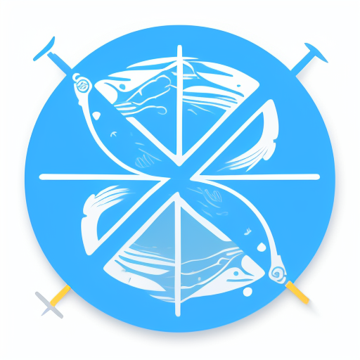
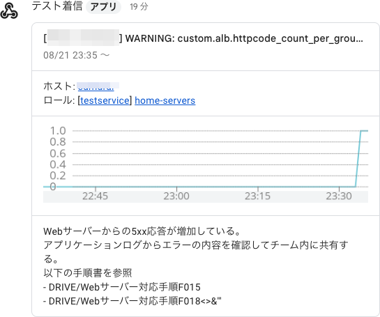

# Saba Webhook Gateway for Node.js



Saba Webhook Gateway for Node.jsは、監視サービス[Mackerel](https://ja.mackerel.io)のWebhookを受け取り、ほかの形式のWebhookに変換して引き渡すゲートウェイのライブラリです。

以下のMackerelのWebhook通知に対応します。

- サンプル（Mackerelの「テスト」で送出されるもの）
- アラート通知
- アラートグループ通知
- ホストステータス変更
- ホスト登録
- ホスト退役
- 監視ルールの操作（追加・変更・削除）

オリジナルの実装はRuby版の[saba-webhook-gateway](https://github.com/kmuto/saba-webhook-gateway)です。

## ビルド

```
npm install
npx tsc
```

distフォルダに以下のファイルが生成されます。

- `SabaWebhookGatewayBase.js`: 基底クラス
- `SabaWebhookGatewayGoogleChat.js`: GoogleChatクラス
- `index.js`: Google ChatのLambda実装例

## Google Chatでの実行

実装のリファレンスとして、Google Chat Webhook変換を用意しています。各通知をGoogle Chatに送信できます（ただし、現時点でGoogle ChatのWebhookは有償プランのみでしか使えません）。



### Lambdaを使う場合

Lambdaで動かすための実装例を収録しています。

distとnode_modulesをパッケージし、AWS Lambdaにアップロードします。

Google ChatスペースのWebhook URLを取得し、Lambdaの環境変数`GOOGLECHAT_WEBHOOK`に設定してください。

```
https://chat.googleapis.com/v1/spaces/…
```

関数URLまたはAPI GatewayでインターネットからLambdaにアクセスできるようにします。

Mackerel側の通知チャンネルの追加で「Webhook」を選び、URLにエンドポイントURLを指定します。作成されたWebhookチャンネルで「テスト」をクリックすると、サンプルの通知がGoogle Chatに飛びます。

## ライセンス
```
MIT License

Copyright (c) 2023 Kenshi Muto

Permission is hereby granted, free of charge, to any person obtaining a copy
of this software and associated documentation files (the "Software"), to deal
in the Software without restriction, including without limitation the rights
to use, copy, modify, merge, publish, distribute, sublicense, and/or sell
copies of the Software, and to permit persons to whom the Software is
furnished to do so, subject to the following conditions:

The above copyright notice and this permission notice shall be included in all
copies or substantial portions of the Software.

THE SOFTWARE IS PROVIDED "AS IS", WITHOUT WARRANTY OF ANY KIND, EXPRESS OR
IMPLIED, INCLUDING BUT NOT LIMITED TO THE WARRANTIES OF MERCHANTABILITY,
FITNESS FOR A PARTICULAR PURPOSE AND NONINFRINGEMENT. IN NO EVENT SHALL THE
AUTHORS OR COPYRIGHT HOLDERS BE LIABLE FOR ANY CLAIM, DAMAGES OR OTHER
LIABILITY, WHETHER IN AN ACTION OF CONTRACT, TORT OR OTHERWISE, ARISING FROM,
OUT OF OR IN CONNECTION WITH THE SOFTWARE OR THE USE OR OTHER DEALINGS IN THE
SOFTWARE.
```
